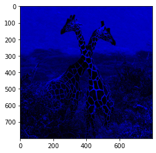
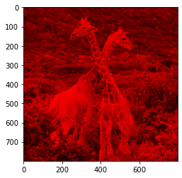

<h4 style="text-align:right">Ingrid Pérez</h4>

<h3><center>Text Mining & Image Recognition
<br />Hoja de Trabajo # 1</center></h3>

### Problema 1:
Desarrolle una función la cual reciba dos parámetros, una imagen y un entero llamado color, la función debe devolver una imagen la cual tenga activos los canales de color según los siguientes puntos:
- Si el parámetro color vale 1, la imagen debe mostrar activos únicamente el color azul.
- Si el parámetro color vale 2, la imagen debe mostrar activos únicamente el color verde.
- Si el parámetro color vale 3, la imagen debe mostrar activos únicamente el color rojo.
- Si el parámetro color vale 10, la imagen debe mostrar activos únicamente los colores rojo y verde.
- Si el parámetro color vale 20, la imagen debe mostrar activos únicamente los colores verde y azul.
- Si el parámetro color vale 30, la imagen debe mostrar activos únicamente los colores azul y rojo.


```python
import cv2
import numpy as np
import matplotlib.pyplot as plt
```


```python
def modificaciones_color_bgr(red,green,blue,parametro):
    blue = 0 if parametro != 1 and parametro != 20 and parametro != 30 else blue
    green = 0 if parametro != 2 and parametro != 10 and parametro != 20 else green
    red = 0 if parametro != 3 and parametro != 10 and parametro != 30 else red
    return [red,green,blue]
    
def modificar_imagen(ruta_imagen, color):
    img = cv2.imread(ruta_imagen)
    img = cv2.cvtColor(img,cv2.COLOR_BGR2RGB)
    alto =  img.shape[0]
    ancho = img.shape[1]
    lienzo = np.zeros((alto,ancho,3))
    for i in range(0,alto):
        for j in range(0,ancho):
            pixel = img[i,j]
            red = pixel[0] 
            green = pixel[1] 
            blue = pixel[2] 
        
            lienzo[i,j] = modificaciones_color_bgr(red,green,blue,color)
    cv2.imwrite("modificada.jpg",lienzo)
    return cv2.imread("modificada.jpg")

print("1 - Azul")
plt.imshow(modificar_imagen("j.jpg",1))
plt.show()

print("2 - Verde")
plt.imshow(modificar_imagen("j.jpg",2))
plt.show()

print("3 - Rojo")
plt.imshow(modificar_imagen("j.jpg",3))
plt.show()

print("10 - Rojo y verde")
plt.imshow(modificar_imagen("j.jpg",10))
plt.show()

print("20 - Verde y azul")
plt.imshow(modificar_imagen("j.jpg",20))
plt.show()

print("30 - Azul y rojo")
plt.imshow(modificar_imagen("j.jpg",30))
plt.show()
```

    1 - Azul
    


    

    


    2 - Verde
    


    

    


    3 - Rojo
    


    

    


    10 - Rojo y verde
    


    

    


    20 - Verde y azul
    


    

    


    30 - Azul y rojo
    


    

    


### Problema 2:
En el .zip del laboratorio se le compartió un conjunto de imágenes en escala de grises (imagen1, imagen2, perro) estas imágenes fueron creadas utilizando una escala de grises en 3D, cree una función que dadas las 3 imágenes se construya la imagen original a color.


```python
def construir_imagen(nombre_imagen):
    ruta = nombre_imagen+"/"+nombre_imagen+"_salida_gray_";
    img_rojo = cv2.imread(ruta+"rojo.jpg")
    img_rojo = cv2.cvtColor(img_rojo,cv2.COLOR_BGR2RGB)
    img_verde = cv2.imread(ruta+"verde.jpg")
    img_verde = cv2.cvtColor(img_verde,cv2.COLOR_BGR2RGB)
    img_azul = cv2.imread(ruta+"azul.jpg")
    img_azul = cv2.cvtColor(img_azul,cv2.COLOR_BGR2RGB)
    alto =  img_rojo.shape[0]
    ancho = img_rojo.shape[1]
    lienzo = np.zeros((alto,ancho,3))
    for i in range(0,alto):
        for j in range(0,ancho):
            red = img_rojo[i,j][0]
            green = img_verde[i,j][1]
            blue = img_azul[i,j][2]
            
            lienzo[i,j] = [red,green,blue]
    cv2.imwrite("construida.jpg",lienzo)
    return cv2.imread("construida.jpg")

print("imagen1")
plt.imshow(construir_imagen("imagen1"))
plt.show()

print("imagen2")
plt.imshow(construir_imagen("imagen2"))
plt.show()

print("perro")
plt.imshow(construir_imagen("perro"))
plt.show()

```

    imagen1
    


    

    


    imagen2
    


    

    


    perro
    


    

    


### Problema 3:
Cree una función que dada una imagen cree una escala de grises en tres dimensiones, tome en cuenta que su función debe crear 3 imágenes como salida. Para entregar este ejercicio debe incluir una las imágenes que haya utilizado como prueba y el resultado de las misma, no puede utilizar la imagen del Problema #2.


```python
def generar_imagenes_por_color(ruta_imagen):
    img = cv2.imread(ruta_imagen)
    img = cv2.cvtColor(img,cv2.COLOR_BGR2RGB)
    alto =  img.shape[0]
    ancho = img.shape[1]
    rojo = np.zeros((alto,ancho,1))
    verde = np.zeros((alto,ancho,1))
    azul = np.zeros((alto,ancho,1))
    for i in range(0,alto):
        for j in range(0,ancho):
            pixel = img[i,j]
            blue = pixel[2] 
            green = pixel[1]
            red = pixel[0] 
            rojo[i,j] = red
            verde[i,j] = green
            azul[i,j] = blue
    cv2.imwrite("jirafa/jirafa_salida_gray_rojo.jpg",rojo)
    cv2.imwrite("jirafa/jirafa_salida_gray_verde.jpg",verde)
    cv2.imwrite("jirafa/jirafa_salida_gray_azul.jpg",azul)
    return [cv2.imread("jirafa/jirafa_salida_gray_rojo.jpg"), 
            cv2.imread("jirafa/jirafa_salida_gray_verde.jpg"),
            cv2.imread("jirafa/jirafa_salida_gray_azul.jpg")]

print("rojo")
plt.imshow(generar_imagenes_por_color("j.jpg")[0])
plt.show()

print("verde")
plt.imshow(generar_imagenes_por_color("j.jpg")[1])
plt.show()

print("azul")
plt.imshow(generar_imagenes_por_color("j.jpg")[2])
plt.show()
```

    rojo
    


    

    


    verde
    


    

    


    azul
    


    

    


```python
#prueba
print("jirafa")
plt.imshow(construir_imagen("jirafa"))
plt.show()
```

    jirafa
    


    

    


### Problema 4:
Cree una función que dada una imagen, muestre el histograma de cada canal de color y el de escala de grises (utilice un promedio aritmético para su escala de grises, no puede usar funciones de opencv), sus histogramas deben incluir una línea vertical la cual muestre el valor de la media de la distribución.


```python
def histogramas(ruta_imagen):
    img = cv2.imread(ruta_imagen)
    img = cv2.cvtColor(img,cv2.COLOR_BGR2RGB)
    alto =  img.shape[0]
    ancho = img.shape[1]
    rojo = []
    verde = []
    azul = []
    promedio = []
    for i in range(0,alto):
        for j in range(0,ancho):
            pixel = img[i,j]
            rojo.append(pixel[0])
            verde.append(pixel[1])
            azul.append(pixel[2])
            promedio.append((int(pixel[0])+int(pixel[1])+int(pixel[2]))/3)
    print("rojo")
    plt.hist(rojo, bins=20, color='red', edgecolor='k', alpha=0.65)
    plt.axvline(np.mean(rojo), color='k', linestyle='dashed', linewidth=1)
    min_ylim, max_ylim = plt.ylim()
    plt.text(np.mean(rojo)*1.1, max_ylim*0.9, 'Media: {:.2f}'.format(np.mean(rojo)))
    plt.show()
    print("verde")
    plt.hist(verde, bins=20, color='green', edgecolor='k', alpha=0.65)
    plt.axvline(np.mean(verde), color='k', linestyle='dashed', linewidth=1)
    min_ylim, max_ylim = plt.ylim()
    plt.text(np.mean(verde)*1.1, max_ylim*0.9, 'Media: {:.2f}'.format(np.mean(verde)))
    plt.show()
    print("azul")
    plt.hist(azul, bins=20, color='blue', edgecolor='k', alpha=0.65)
    plt.axvline(np.mean(azul), color='k', linestyle='dashed', linewidth=1)
    min_ylim, max_ylim = plt.ylim()
    plt.text(np.mean(azul)*1.1, max_ylim*0.9, 'Media: {:.2f}'.format(np.mean(azul)))
    plt.show()
    print("promedio")
    plt.hist(promedio, bins=20, color='gray', edgecolor='k', alpha=0.65)
    plt.axvline(np.mean(promedio), color='k', linestyle='dashed', linewidth=1)
    min_ylim, max_ylim = plt.ylim()
    plt.text(np.mean(promedio)*1.1, max_ylim*0.9, 'Media: {:.2f}'.format(np.mean(promedio)))
    plt.show()
    
histogramas("j.jpg")
```

    rojo
    


    

    


    verde
    


    

    


    azul
    


    

    


    promedio
    


    

    


### Problema 5:
Investigue en que consiste el enfoque de escala de grises ponderado, luego de esto implemente una
función que dada una imagen, realice una escala de grises ponderada (notar que no existe una
solución única).


```python
def imagen_a_gris_ponderado(ruta_imagen):
    img = cv2.imread(ruta_imagen)
    alto =  img.shape[0]
    ancho = img.shape[1]
    gris_ponderado = np.zeros((alto,ancho,1))
    for i in range(0,alto):
        for j in range(0,ancho):
            pixel = img[i,j]
            blue = pixel[2] #RGB
            green = pixel[1] #RGB
            red = pixel[0] #RGB
            gris_ponderado[i,j] = int(0.299*blue + 0.587*green + 0.114*red)
    cv2.imwrite("gris_ponderado.jpg",gris_ponderado)
    gris_p = cv2.imread("gris_ponderado.jpg")
    return gris_p

plt.imshow(imagen_a_gris_ponderado("j.jpg"))
plt.show()
```


    

    


### Problema 6:
Investigue brevemente en que consiste el espacio de color HSV y como se mapean colores a dicho espacio, para entregar este ejercicio puede hacerlo por medio de Markdown en el mismo Notebook donde trabajó los demás ejercicios.

# HSV
HSV es un sistema de gestión de colores que forma parte de una familia de sistemas basados en la percepción del color, basada en tres componentes definidos por un enfoque psicológico y perceptivo del color: matiz, saturación y valor.

HSV:
- Hue (matiz)
- Saturation (satuación)
- Value (valor

La escala HSV proporciona una lectura numérica de su imagen que corresponde a los nombres de color que contiene. 

- Matiz (H): Es la porción de color del modelo, expresada como un número de 0 a 360 grados
 - Rojo, entre 0 y 60 grados.
 - Amarillo, entre 61 y 120 grados.
 - Verde, entre 121 y 180 grados.
 - Cian, entre 181 y 240 grados.
 - Azul, entre 241 y 300 grados.
 - Magenta, entre 301 y 360 grados.
 
- Saturación: Describe la cantidad de gris en un color particular, de 0 a 100 por ciento. Reducir este componente hacia cero introduce más gris y produce un efecto difuminado. A veces, la saturación aparece como un rango de 0 a 1, donde 0 es gris y 1 es un color primario.

- Valor (o Brillo): El valor funciona junto con la saturación y describe el brillo o la intensidad del color, de 0 a 100 por ciento, donde 0 es completamente negro y 100 es el más brillante y revela la mayor parte del color.


### Visualización en HSV
El modelo HSV se usa particularmente en aplicaciones gráfica, muchas veces para ayudar a un usuario a elegir un color. Usada de esta manera, la rueda HSV se emplea generalmente. En esta, el matiz (hue) está representado por una región circular y se puede usar un triángulo separado para representar la saturación y el valor. Normalmente, el eje vertical del triángulo representa la saturación, mientras que el eje horizontal representa el valor. 
De esta forma se puede elegir un color primero seleccionando el tono o matiz en la parte circular, luego la saturación y el valor en el triángulo.


```python

```
